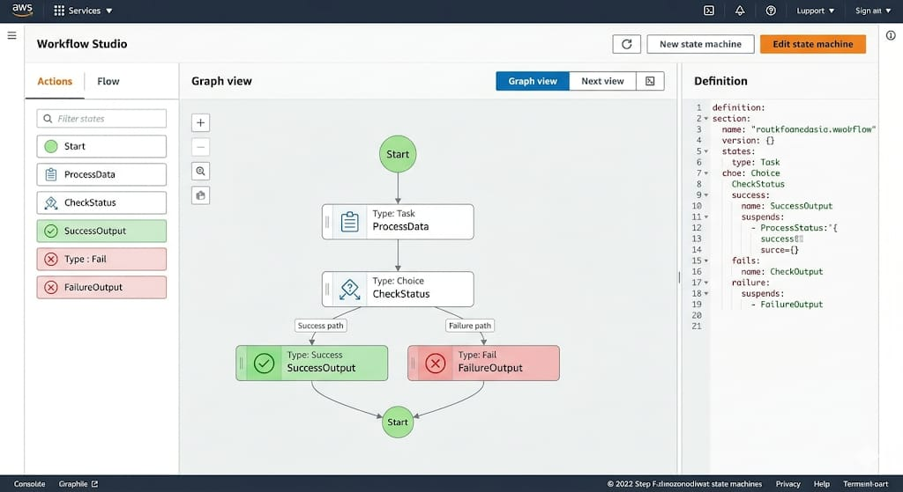
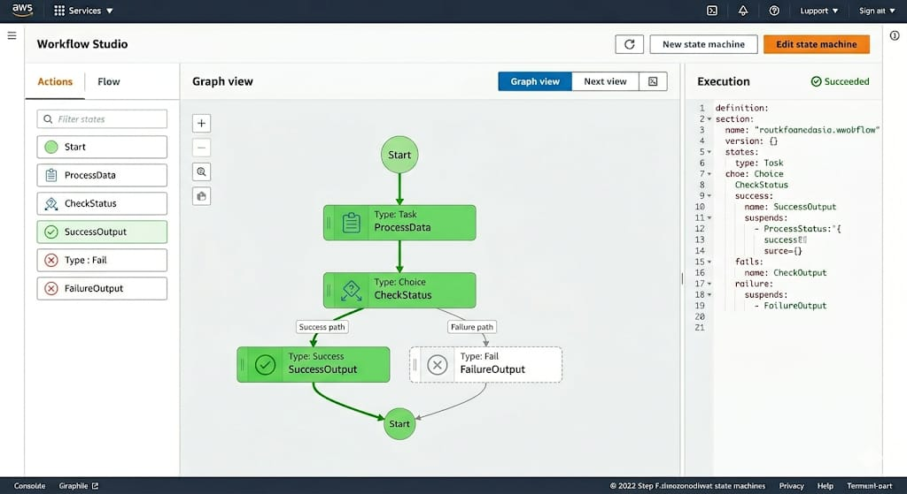
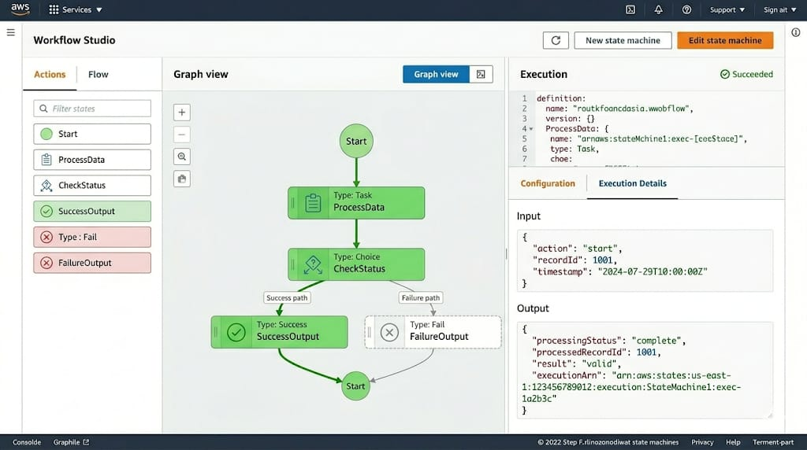

# ☁️ Orquestração de Workflows com AWS Step Functions

Repositório dedicado ao desafio de projeto "Explorando Workflows Automatizados com AWS Step Functions" pela DIO. Este projeto demonstra a automação de processos em nuvem utilizando arquitetura *serverless* para coordenar múltiplos serviços AWS.

## 🎯 Objetivo
Consolidar conhecimentos em **AWS Step Functions**, focando na criação de workflows resilientes, documentação técnica estruturada e compartilhamento de insights sobre orquestração de serviços.

## 🏗️ Estrutura do Projeto
A organização do repositório segue as melhores práticas para documentação técnica:
*   **/assets**: Imagens e diagramas do fluxo (Graph Inspector).
*   **/workflows**: Arquivos JSON em **Amazon States Language (ASL)**.
*   **README.md**: Documentação principal com insights e guia de execução.

## 📊 Visualização do Workflow

Abaixo, as capturas que demonstram a lógica e o funcionamento do sistema:

### 1. Design da State Machine
Exibe a estrutura lógica, estados de tarefa e pontos de decisão (Choice States).

### 2. Execução com Sucesso
Demonstração visual do caminho percorrido pelos dados em uma execução bem-sucedida.

### 3. Detalhes de Input e Output (JSON)
Evidência da manipulação e transformação de dados entre as etapas do workflow.

## 💡 Insights Técnicos
*   **Orquestração Visual**: O Step Functions permite uma visão clara da lógica de negócio, facilitando a manutenção em relação a funções Lambda isoladas.
*   **Tratamento de Erros**: A implementação de políticas de `Retry` e `Catch` no ASL garante que o fluxo seja resiliente a falhas temporárias.
*   **Eficiência de Dados**: O controle fino sobre o JSON de entrada e saída (InputPath, ResultPath) otimiza o tráfego de informações entre serviços.

## 🛠️ Tecnologias Utilizadas
*   **AWS Step Functions**: Orquestrador principal.
*   **AWS Lambda**: Execução de lógica de backend.
*   **Amazon States Language (ASL)**: Definição da máquina de estados via JSON.
*   **GitHub**: Controle de versão e documentação.

---

**Maike Simoncini da Silva**  
*Tecnólogo em ADS | Especializando em IA Engineer*
